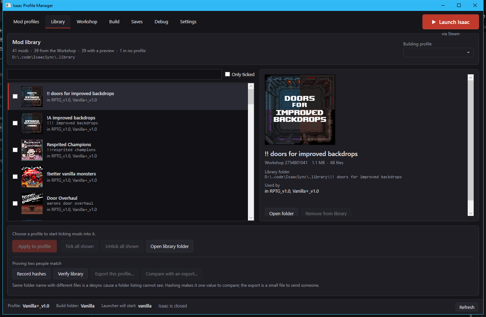
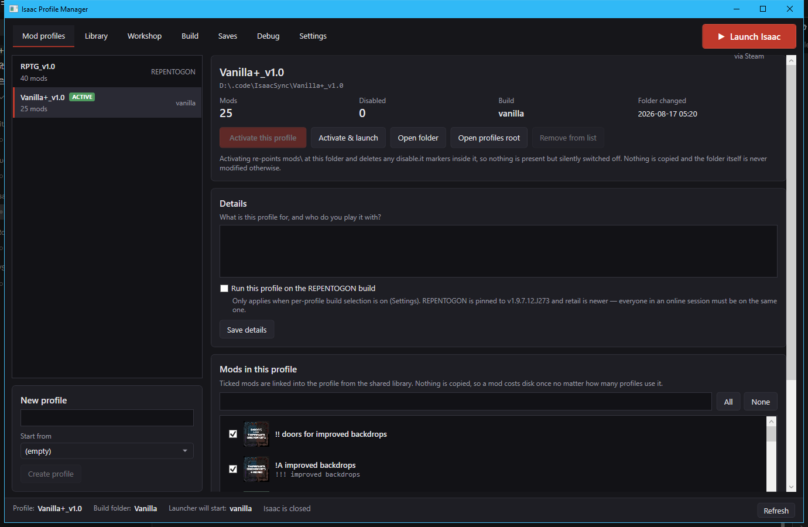
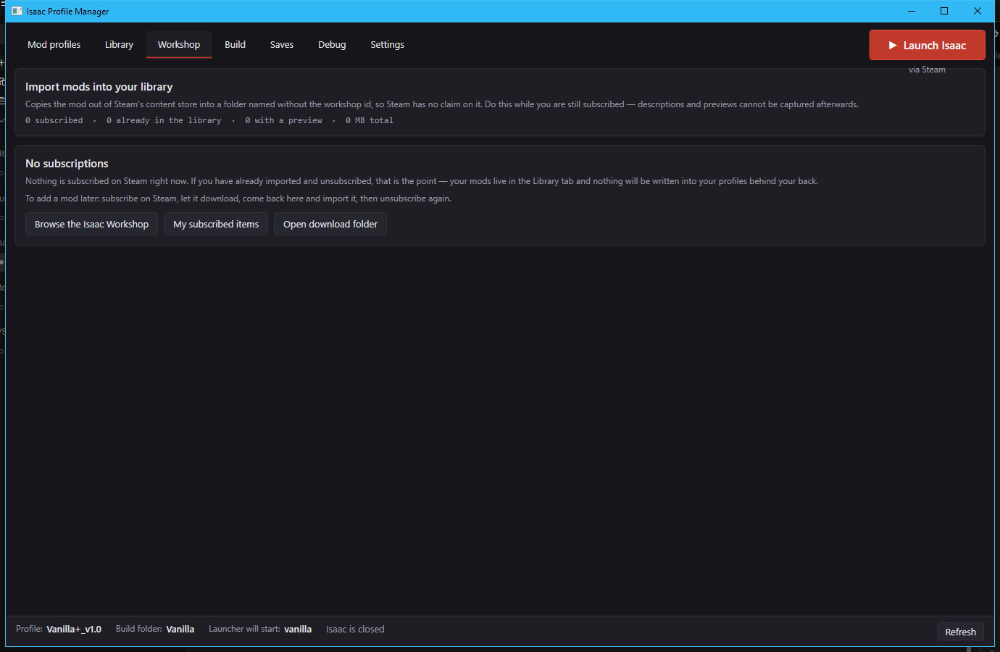
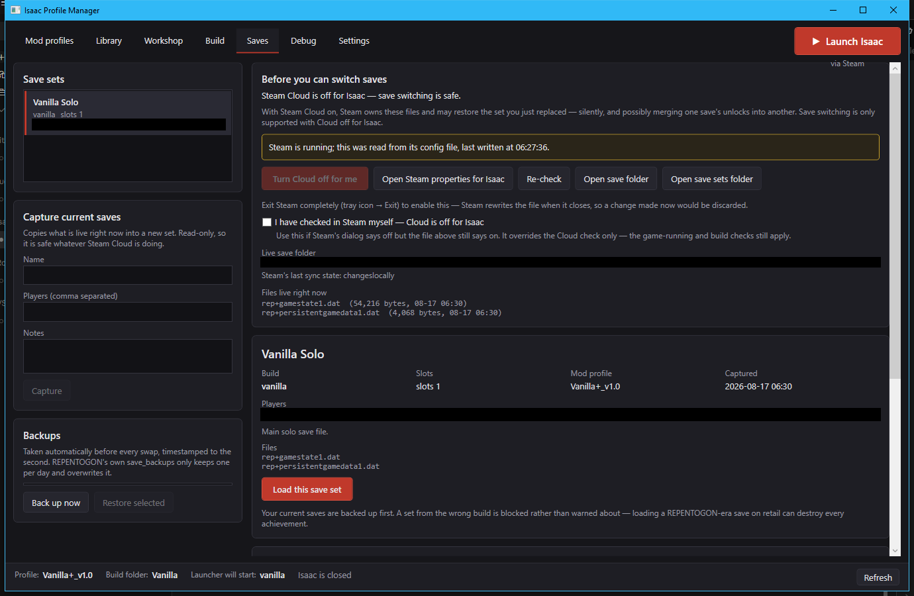
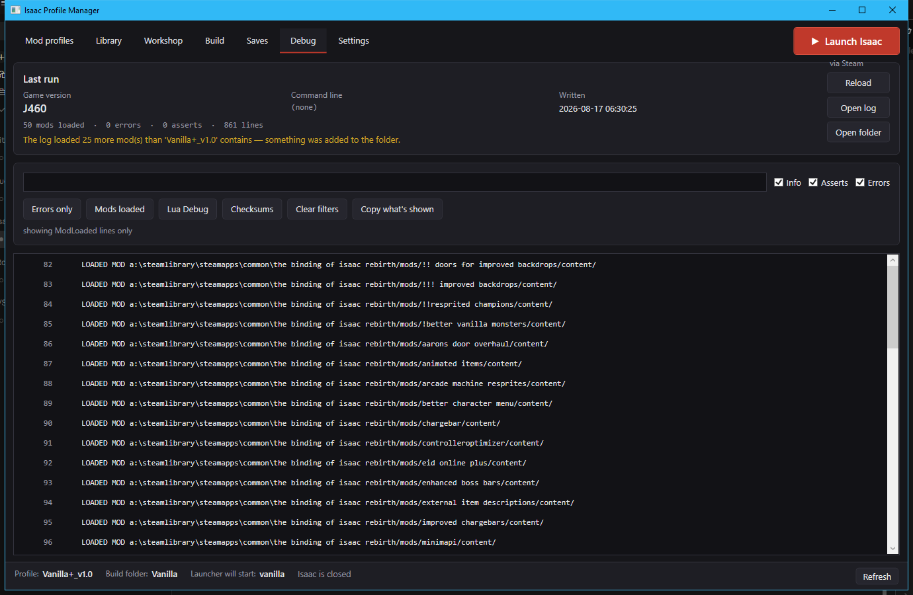
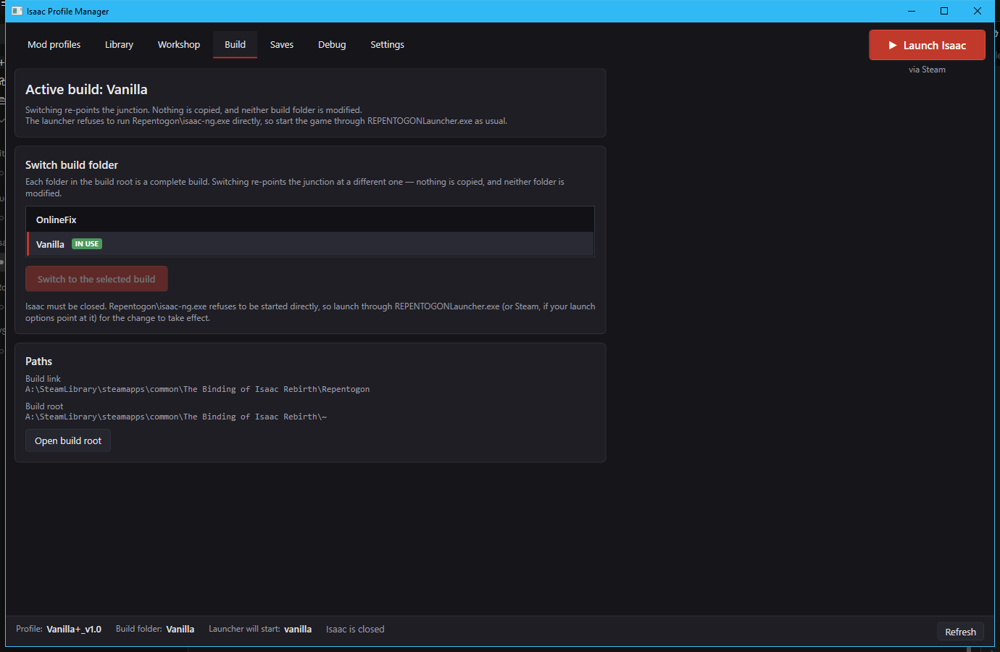

# Isaac Profile Manager

**Switch mod setups for The Binding of Isaac instantly, keep them byte-identical
across everyone you play with, and stop Steam quietly putting mods back.**

No second install. No copying gigabytes around. Switching a profile re-points a
directory junction, so it takes about a millisecond.



---

## The problems it solves

**Repentance+ online co-op needs every player to have identical mods.** Not the
same mod *names* — the same *files*. One person with a slightly different version
desyncs the lobby, and the error tells you nothing useful.

**Steam Workshop overwrites your setup.** Subscribed mods get re-laid into
`mods\` after a game update. If `mods\` is your co-op profile, they land *there*,
and nothing warns you.

**There are only three save slots.** Different people, different modpacks,
different builds — three slots doesn't cover it, and nothing labels which is which.

**REPENTOGON pins the game to v1.9.7.12.J273 while retail is newer.** Two players
on different builds desync on the very first frame, and the log never says why.

---

## What it does

### Mod profiles

A profile is a set of mods. Switch between them instantly; the game's `mods\`
folder is a junction that gets re-pointed. Each profile carries notes on what
it's for and who you play it with, and can select which build it runs on.



### One shared library, not a copy per profile

Every mod is stored **once** in a library. Profiles are built from it with
per-mod links, so ten profiles sharing forty mods costs you forty mods of disk,
not four hundred. Browse it with cover art, names and descriptions — the mod
list the launcher never gave you.

A profile is stored as a small **manifest**: just a list of names. Sharing a
setup with a friend means sending a text file, not gigabytes.

### Import from the Workshop, then cut Steam loose

Subscribe to what you want, import it, then unsubscribe. Import copies the mod
out of Steam's store into a folder named **without** the workshop id, so Steam
has no claim on it — and captures the name, description and preview image while
you're still subscribed, because that data is gone afterwards.

With nothing subscribed, a game update has nothing to re-download into your
profiles. The overwrite problem stops existing rather than being worked around.



### Updates, without resubscribing to everything by hand

Cutting Steam loose costs you updates: a mod in the library is a detached copy,
so when its author pushes a fix, nothing tells you.

**Check for updates** asks the Workshop when each mod last changed. It needs no
subscription and no Steam client, so it disturbs nothing and you can run it as
often as you like. On the reference library it found 9 of 40 mods had moved on.

**Update everything stale** then resubscribes to *only those mods*, waits for
Steam to download them, replaces the library copies, and unsubscribes again. All
your profiles are junctions into the library, so they all pick up the new files
at once — there is no per-profile update step.

Three things it is careful about:

- Steam must be running and **Isaac must be closed**. Subscribing on its own does
  not touch `mods\`, but launching the game while subscribed is what makes Steam
  re-lay mods into whichever profile is active.
- The old copy of each mod is moved to `.backup`, never overwritten in place —
  and it is a genuine replace, so files the author *deleted* upstream disappear
  from your copy too. A merge would leave your bytes matching nobody.
- Updated mods have new hashes. **Everyone you play with needs the same update**,
  or you will desync. The app re-records hashes afterwards so you can send a
  fresh export.

The unsubscribe runs even if something fails partway, because an account left
subscribed is exactly the state that starts re-laying mods into your profiles.

### Send someone your whole mod set

Sharing a modpack used to mean sending a folder. Now you send a small record of
every mod's Workshop id, its library name, and its hash — and the other person's
copy of the app rebuilds the set from Steam.

Whoever you send it to opens **Import...**, sees exactly what will happen before
committing, and the app downloads the whole set — subscribing to only the mods
they are missing, taking the files, and unsubscribing again. It then builds the
profile and checks every mod against your hashes, so you both know you match
byte for byte.

Mods they already have with a matching hash are skipped, so a second person
joining a group only downloads the difference.

**Import also accepts a Steam collection id**, which is ten digits — short,
browsable, and handy for grabbing a public modpack, but a collection cannot
carry hashes, so it can tell you which mods to get and not whether you match.

Anything that is not a Workshop item — a hand-installed mod — travels as a name
so the recipient is told about it, but nothing can download it for them. The app
says so plainly at both ends.

> **Changing soon.** Today this is a **share code**: a long string you paste,
> around 3.5 KB for a 40-mod set, because the ids and hashes *are* the payload.
> It is being replaced by a short link and a file, both sent from the app. A
> Steam collection id is only short because Steam stores the list — so the app
> will store the list too. See [`docs/multi-device.md`](docs/multi-device.md).

### Setting up from someone else's profile

If a friend already has the modpack, you do not need to build anything. During
first-time setup, tick **"I have a share code or profile from someone"**; setup
finishes normally and then opens the import, which downloads the whole set from
the Workshop and builds the profile for you.

The same import lives on **Mod profiles → Import...** afterwards. It takes a
share code, a Steam collection id, or a profile file, and it shows you exactly
what it will do before it does any of it.

Setting up a **second machine of your own** — a laptop — is a different job, and
one the app does not yet make easy: you can sync the profiles folder and point a
fresh install at it, but nothing recognises that the folder already has
everything in it. That is [planned](docs/multi-device.md).

### Prove you and your friends match

Same folder name with different contents is a real desync cause and it's
invisible to a folder listing. The library hashes every mod, so:

- **Verify** re-reads every byte and tells you what changed since you recorded it
- **Export** writes your profile plus its hashes to one small file
- **Compare** diffs your setup against a friend's export and reports
  `DIFFERENT` for same-name-different-files, plus what each of you is missing

Instead of "I think we have the same mods", you get a yes or no.

### Save sets

Capture your saves as a named set tagged with the build, the mod profile, who
you play with, and **per-slot notes** — "slot 2 is the no-mods run" is the thing
that stops someone overwriting it.

Loading a set from the wrong build is **blocked, not warned about**: a
REPENTOGON-era save loaded on retail can destroy every achievement. Your current
saves are backed up before every swap, timestamped to the second.



A set carries **the whole of what the game reads for a slot**, not just the
save file: each mod's own per-slot data from the game's `data\` folder, and
REPENTOGON's modded achievement and completion-mark state. Restoring unlocks
without the mod state produced alongside them is a mismatch, and until 2.0 no
save tool carried it.

Every capture files the previous revision into the set's **history** first, so
re-capturing is never a way to lose something. Restore any revision from the
Saves screen.

The Saves screen also **reads the save files**: achievements unlocked, items
touched, challenges done, bosses killed and the game's own save counter, per
slot, for every set and for what is live. Pick another set under *Compare
unlocks with* and it says what each has that the other lacks. **Import a save
file into a slot** takes a downloaded fully-unlocked save, a friend's file or
one of REPENTOGON's daily backups, checks it is really a save, and files it
into a set. **Export as a file** writes the whole set as one `.ipmsave`, which
imports on another machine as a new set, gates and all.

### Play: what happens when you press Launch

The first screen resolves the four things a launch depends on **from disk** —
the mods link, the live save files hashed against every set, the launcher's
ini, and the last log's game version — and runs them through a guard:

- A save from the **wrong build**, or a **different game version** than this
  machine last ran, **blocks** the button.
- A save made with a **different mod profile** than the one active is a
  recommendation, with a *Switch and launch* button beside it.
- Anything else is a note.

**Play a save set** does the whole thing from the other end: pick a set, and
the app loads it, activates the mod profile it was made with, points the
launcher at its build, and starts the game.

**When the game closes**, the app re-hashes the live saves and offers to
capture the run you just played into the set that was live. Set it to
*Automatic* and progress stops being stranded in the live folder. It only
fires while the app is open, which is where you launched from anyway.

Every screen opens with a short card saying what it is for and where things
are. *Hide tips* removes them all at once; Settings brings them back.

### Saves that follow you between your own machines

For a copy Steam Cloud does not cover. Each machine writes only its own
**lane**; the app compares revisions with a vector clock and pulls or pushes.
Two machines that both played from the same point are a **fork**, shown with
both revisions kept, never merged.

Two places a lane can live, chosen in Settings:

- **A folder you already sync** — Syncthing, OneDrive, a network share. The
  default is `.savesync` inside your profiles root.
- **Cloud** — a small Cloudflare Worker over an R2 bucket that you deploy under
  your own account in two commands (`cloud/save-sync-worker/README.md`). It
  runs on a free `workers.dev` address, needs no domain, and the address is
  just a setting. A **sync key** generated on one machine and pasted on the
  others is both the password and the namespace, so one Worker can serve a
  whole friend group without anyone seeing anyone else's saves.

With **Automatic** on, the Play screen pulls a newer revision before you press
Launch and pushes after the game closes and the run is captured. Switching
machines is then: close the game on one, open the app on the other, launch.

### Read the log without opening a 200 KB text file

Game version, command line, mods loaded, error counts — and a check of the log's
mod count against your active profile's, which is how you notice something got
added behind your back. Filter by severity, jump to errors, mods, Lua output or
the desync table, and copy what's shown to paste to whoever you play with.

When a desync table is present it's parsed into rows with the disagreeing player
badged **ODD ONE OUT**, because that's the machine to investigate.



### Build switching

The game's `Repentogon\` folder can be a junction too, so you can keep several
complete builds side by side and swap between them instantly. Useful for holding
a known-good build to roll back to after an update breaks something, testing a
version before committing to it, or keeping a variant whose files differ for
compatibility reasons.

Nothing in the game directory is modified — the link moves, the folders don't.



---

## How it works

Three ideas, all of them boring on purpose:

```
<ProfilesFolder>\.library\<mod>\        one real copy of each mod        [sync this]
<ProfilesFolder>\.profiles\<name>.json  a manifest: just mod names       [sync this]
<ProfilesFolder>\<name>\                links built from the manifest    [don't sync]

...\The Binding of Isaac Rebirth\
  mods\  ==>  junction to <ProfilesFolder>\<active profile>
```

Isaac loads mods through junctions — verified with a probe mod, including two
hops from `mods\` through the profile folder into the library. That's what makes
the shared library possible instead of a full copy per profile.

Because a manifest is machine-independent text, sharing a profile is sending one
small file. Your friend's copy rebuilds the same profile against their own
library, and the hashes prove it matches.

---

## Safety

This tool moves other people's mod collections and save files around, so:

- **Junctions are deleted with a call that cannot recurse.** A recursive delete
  aimed at a junction can follow the link and wipe the target. That never happens
  here.
- **A real folder where a link belongs is refused, not deleted.** If `mods\` is a
  real folder, the tool stops and tells you.
- **Nothing is ever deleted — things are renamed.** Your existing mods become
  `mods.backup-<timestamp>`; replaced saves and removed library mods go to a
  timestamped `.backup` folder.
- **Saves are backed up before every swap**, timestamped to the second.
  REPENTOGON's own `save_backups` keeps only one per day and overwrites it.
- **Cross-build save loads are blocked**, not warned about.
- **It refuses rather than guesses.** Wrong config version, ambiguous build
  folder, Isaac still running — all stop with an explanation.
- **No administrator required.** Creating a junction doesn't need it.

There are **230 automated tests**, most of them exercising exactly these refusals
against throwaway directories.

---

## Install

1. Download the exe from [Releases](../../releases)
2. Run it
3. Setup detects your install, picks a profiles folder, and copies your current
   mods into your first profile

That's it. Your original `mods\` folder is renamed, never deleted — delete it
yourself once you're happy.

Self-contained, no .NET runtime needed. Windows only; junctions are a Windows
filesystem feature.

> Windows SmartScreen will warn about an unsigned exe. Code signing certificates
> cost more than this project does. Build it yourself if you'd rather —
> instructions below.

---

## Sharing a setup with people you play with

**Syncthing** — share your profiles folder. Set your side to *Send Only* and
theirs to *Receive Only*, so removing a mod on your machine removes it on theirs
while their local experiments never travel back. The tool writes the `.stignore`
and `.gitignore` that stop Syncthing and git fighting over the same directory.

**Or just send a file** — export the profile and send the `.json`. If they
already have the library, that's all they need.

Then have them **Compare** against your export before you play. It takes a
second and it settles the argument.

**Coming next** — [`docs/multi-device.md`](docs/multi-device.md) is the working
plan for the next block of work:

- Your laptop set up from the synced folder in one screen, instead of a fresh
  install that ignores everything already there
- Save sets that follow you between your own machines, with forks surfaced
  rather than silently resolved
- The run you just played captured when you close the game, instead of stranded
  in the live folder
- A save set that requires the build it was made with and recommends the mod
  profile, at the moment you press Launch
- Share and import from the app by link or file, with the share code retired

---

## Still desyncing?

Identical mod folders are necessary but not sufficient. In rough order of how
often they're the cause:

**Game build.** Compare `Game Version:` in each player's log — the Debug tab puts
it at the top. It must match exactly.

**Save state.** Unlock state feeds item pool composition, which feeds RNG. A
mismatch desyncs within seconds. A fresh save on all machines is the quick test.

**Loose files in `resources\`.** Anything dropped there overrides everything,
never appears in the mod list, and is invisible to any sync setup.

**Mod versions.** Same folder name, different files inside. This is what the
hash comparison is for.

### Reading a desync

The host's log prints a per-player table:

```
Checksums:
 - Player0: Checksum (1000fc7b), Global RNG checksum (f4d2dca3)
 - Player1: Checksum (1000fc7b), Global RNG checksum (f4d2dca3)
 - Player2: Checksum (fb9494d0), Global RNG checksum (0dbd257b)
```

Whoever's row differs is the machine to investigate. The Debug tab marks it for
you. Then:

| What you see | What it means |
|---|---|
| Save checksums differ in the recovery block | Unlock/save state mismatch |
| Entity types or positions differ | Mod content mismatch — files, versions, or load order |
| `No Entity Desyncs Detected` but global RNG differs | Something consumed a random number on one client. Usually a mod adding gameplay entities. Bisect by halves |
| Desync at frame 1 | Divergence before anyone pressed a button. Content or save state, never gameplay |

---

## Command line

The original PowerShell script is still here and reads the same config file, so
scripted switching and desktop shortcuts keep working:

```powershell
.\IsaacProfiles.ps1 -Use coop-with-alex
.\IsaacProfiles.ps1 -List
```

---

## Building from source

Needs the [.NET 8 SDK](https://dotnet.microsoft.com/download).

```bash
git clone https://github.com/XevioQwerty/Isaac-Profile-Manager
```

Then build and install it somewhere permanent, with a Start Menu entry:

```bash
powershell -ExecutionPolicy Bypass -File .\Install.ps1
```

That publishes to `%LOCALAPPDATA%\Programs\IsaacProfileManager` and adds a
shortcut, so you launch a real program rather than a script — and re-running it
is how you update after pulling. Add `-DesktopShortcut` for one on the desktop,
or `-Destination 'D:\Apps\IsaacProfileManager'` to put it wherever you like. No
administrator needed.

The app ships as **two** executables. `ipm-steam-helper.exe` is 32-bit because
Isaac ships only a 32-bit `steam_api.dll`, and it is what talks to Steam for
Workshop updates and share imports. It must sit beside `IsaacProfileManager.exe`;
`Install.ps1` and `Package.ps1` both put it there, and both are versioned from
`Directory.Build.props` so they can never disagree about which build they are.

To check a build before releasing it:

```bash
powershell -ExecutionPolicy Bypass -File .\Test.ps1 -Live
```

Without `-Live` that builds and runs the unit tests. With it, it also exercises
Steam's public API and the helper against your real Steam client, read-only —
which is what catches an endpoint changing shape or the helper failing to bind
after a game update.

To produce a release:

```bash
powershell -ExecutionPolicy Bypass -File .\Package.ps1
```

That writes a portable zip and an installer to `dist\`. The installer needs
[Inno Setup 6](https://jrsoftware.org/isinfo.php); without it the zip is still
built.

To build without installing:

```bash
dotnet test
dotnet publish src/IsaacProfileManager -c Release -r win-x64 --self-contained true -p:PublishSingleFile=true -p:IncludeNativeLibrariesForSelfExtract=true
```

The filesystem logic lives in `IsaacProfileManager.Core` with no UI dependency,
so the risky parts are testable on their own. `CLAUDE.md` documents what was
learned by probing a real install — the launcher's actual behaviour, where saves
really live, how Steam materialises Workshop content. Most of it isn't written
down anywhere else and several confident guesses turned out wrong, so it's worth
reading before changing anything under `Services/`.

---

## License

MIT. Do whatever you want with it.
